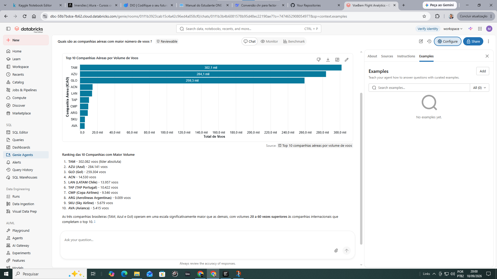
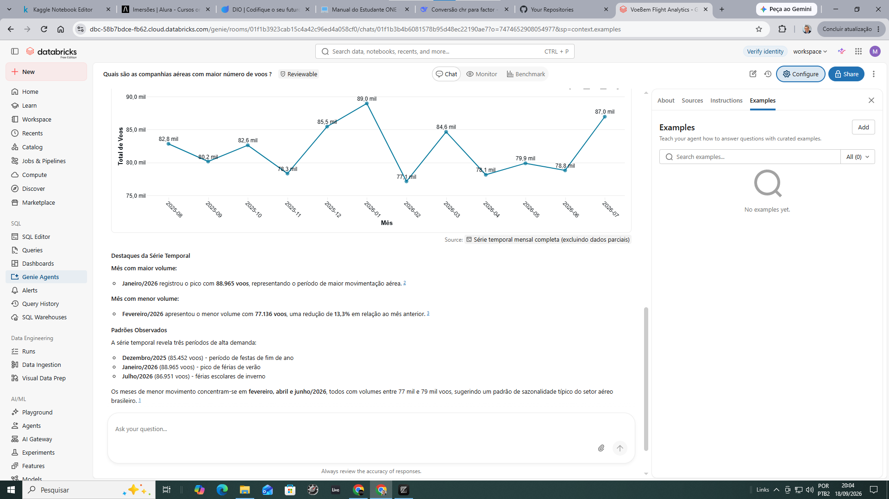
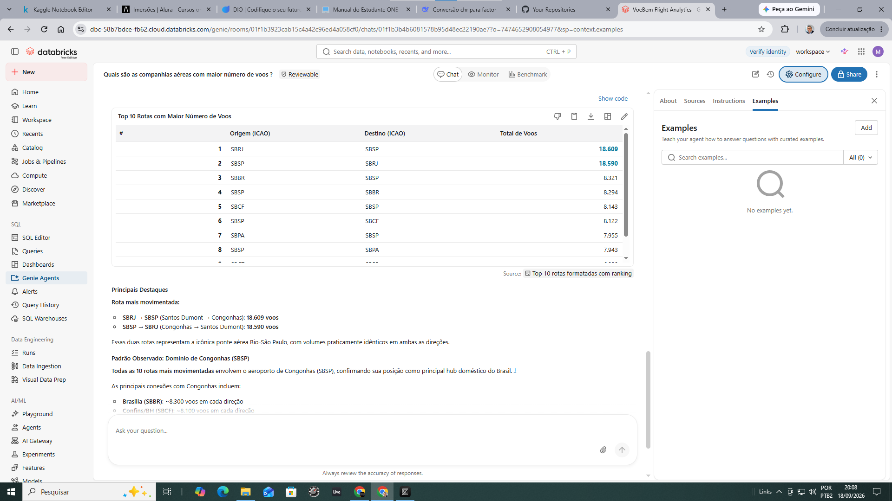

# ✈️ VoeBem Analytics AI

Projeto de Engenharia de Dados e Inteligência Artificial para análise de dados da aviação brasileira utilizando **Databricks**, **Apache Spark**, **Delta Lake**, **Unity Catalog** e **Databricks Genie Agents**.

O projeto transforma dados públicos da **ANAC (Agência Nacional de Aviação Civil)** em uma arquitetura analítica baseada no padrão **Medallion Architecture — Bronze, Silver e Gold**, culminando em uma camada de KPIs e em um agente de IA capaz de responder perguntas de negócio em linguagem natural.

---

## 🎯 Objetivo

Construir um pipeline de dados capaz de transformar dados brutos da aviação brasileira em informações analíticas acessíveis para tomada de decisão.

O projeto permite explorar questões como:

- Quais companhias aéreas possuem maior número de voos?
- Quais são as rotas mais movimentadas?
- Quais aeroportos de origem concentram mais operações?
- Qual o atraso médio de partida por aeroporto?
- Como o número de voos evolui ao longo dos meses?
- Quais padrões operacionais podem ser identificados nos dados?

Além da análise tradicional, o projeto utiliza um **Genie Agent** para permitir consultas aos dados utilizando linguagem natural.

---

## 🏗️ Arquitetura

O projeto utiliza uma arquitetura **Medallion**, dividindo o processamento em três camadas.

```text
ANAC — Dados Abertos
        │
        ▼
┌─────────────────────┐
│       BRONZE        │
│ Ingestão dos dados  │
│ brutos              │
└──────────┬──────────┘
           │
           ▼
┌─────────────────────┐
│       SILVER        │
│ Limpeza             │
│ Padronização        │
│ Transformações      │
└──────────┬──────────┘
           │
           ▼
┌─────────────────────┐
│        GOLD         │
│ KPIs analíticos     │
│ Dados de negócio    │
└──────────┬──────────┘
           │
           ▼
┌─────────────────────┐
│  GENIE AGENT / AI   │
│ Linguagem Natural   │
│         ↓           │
│ Insights de Negócio │
└─────────────────────┘
```

---

## 🥉 Camada Bronze

Responsável pela ingestão e armazenamento inicial dos dados.

Principais características:

- leitura dos arquivos disponibilizados pela ANAC;
- preservação dos dados de origem;
- organização inicial das fontes;
- preparação dos dados para processamento posterior.

Notebooks:

- `01_Bronze_VRA.ipynb`
- `02_Bronze_Referencias.ipynb`

---

## 🥈 Camada Silver

Responsável pela preparação dos dados para análise.

Nesta etapa são realizadas operações de:

- limpeza;
- padronização;
- tratamento de dados;
- transformação;
- preparação das informações operacionais.

Notebook:

- `03_Silver_VRA.ipynb`

---

## 🥇 Camada Gold

Responsável pela criação da camada analítica orientada ao negócio.

Notebook:

- `04_Gold_Analytics.ipynb`

A camada Gold disponibiliza quatro conjuntos principais de indicadores:

| Tabela | Finalidade |
| --- | --- |
| `kpi_companhias` | Indicadores de desempenho e volume de voos por companhia aérea |
| `kpi_rotas` | Indicadores operacionais por rota |
| `kpi_aeroportos_origem` | Indicadores operacionais por aeroporto de origem |
| `kpi_mensal` | Indicadores mensais e análise da evolução temporal dos voos |

---

## 🤖 VoeBem Flight Analytics

Como camada de Inteligência Artificial do projeto foi desenvolvido o **VoeBem Flight Analytics**, utilizando **Databricks Genie Agents**.

O agente utiliza as tabelas analíticas da camada Gold como fonte de informação e permite que usuários façam perguntas diretamente em linguagem natural.

Exemplos de perguntas:

> Quais são as companhias aéreas com maior número de voos?

> Quais são as 10 rotas com maior número de voos?

> Quais são os 10 aeroportos de origem com maior número de voos? Mostre também o atraso médio de partida.

> Como evoluiu mensalmente o número total de voos?

O agente interpreta a pergunta, consulta os dados analíticos e apresenta os resultados por meio de tabelas, gráficos e explicações orientadas ao negócio.

---

## 📊 Validação do agente

Durante a validação do projeto, o agente foi testado nos quatro principais domínios analíticos:

- **Companhias aéreas** — ranking por volume de voos;
- **Rotas** — identificação das rotas com maior volume operacional;
- **Aeroportos de origem** — volume de operações e atraso médio de partida;
- **Evolução mensal** — série temporal do número de voos e identificação de máximos e mínimos.

Os testes demonstraram a integração entre **Engenharia de Dados, Analytics e Inteligência Artificial Generativa**.

---

## 📸 Resultados do VoeBem Flight Analytics

A camada de IA foi validada com consultas em linguagem natural sobre os principais indicadores da camada Gold. Abaixo estão alguns exemplos das respostas geradas pelo **VoeBem Flight Analytics** no Databricks.

### ✈️ Companhias aéreas com maior volume de voos



O agente consulta os indicadores consolidados por companhia aérea e apresenta o ranking de volume de voos em formato visual, acompanhado de uma interpretação dos resultados.

### 📈 Evolução mensal do número de voos



A consulta temporal permite acompanhar a evolução mensal das operações e identificar períodos de maior e menor movimentação ao longo da série analisada.

### 🛫 Rotas com maior número de voos



O agente também identifica as rotas de maior volume operacional, transformando as tabelas analíticas da camada Gold em respostas acessíveis por meio de linguagem natural.

Esses exemplos demonstram o fluxo completo do projeto: **dados públicos → Engenharia de Dados → arquitetura Medallion → camada Gold → IA Generativa → insight de negócio**.

---

## 🛠️ Tecnologias utilizadas

- Databricks
- Apache Spark
- PySpark
- Spark SQL
- Delta Lake
- Unity Catalog
- Databricks SQL
- Databricks Genie Agents
- Python
- SQL
- Git
- GitHub

---

## 📂 Estrutura do repositório

```text
VoeBem-Analytics-AI/
│
├── notebooks/
│   ├── 01_Bronze_VRA.ipynb
│   ├── 02_Bronze_Referencias.ipynb
│   ├── 03_Silver_VRA.ipynb
│   └── 04_Gold_Analytics.ipynb
│
└── README.md
```

---

## 🔄 Pipeline

```text
Dados ANAC
   ↓
Ingestão
   ↓
Bronze
   ↓
Limpeza e Transformação
   ↓
Silver
   ↓
Agregações e KPIs
   ↓
Gold
   ↓
VoeBem Flight Analytics
   ↓
Perguntas em Linguagem Natural
   ↓
Insights de Negócio
```

---

## 💡 Competências demonstradas

### Data Engineering

- ingestão de dados;
- processamento distribuído;
- arquitetura Medallion;
- transformação com PySpark;
- organização de dados analíticos.

### Data Analytics

- criação de KPIs;
- análise de companhias aéreas;
- análise de rotas;
- análise de aeroportos;
- análise de séries temporais.

### Artificial Intelligence

- agente analítico baseado em IA;
- consultas em linguagem natural;
- geração assistida de análises;
- transformação de dados em insights de negócio.

---

## 🚀 Possíveis evoluções

Entre as possíveis extensões do projeto estão:

- criação de dashboard executivo;
- ampliação dos indicadores operacionais;
- análises comparativas de atrasos;
- identificação de padrões sazonais;
- inclusão de novos períodos de dados;
- automação da atualização do pipeline;
- criação de métricas adicionais para aeroportos e companhias;
- evolução da camada de IA para novos casos de uso.

---

## 👤 Autor

**Marcus Guedes**

Profissional com experiência em gestão, marketing, operações e projetos, desenvolvendo soluções que integram **negócios, dados, analytics e Inteligência Artificial**.

- 💻 GitHub: [MCLG1661](https://github.com/MCLG1661)
- 💼 LinkedIn: [Marcus Corrêa Lopes Guedes](https://www.linkedin.com/in/marcusguedes/)

---

## 📌 Fonte dos dados

Dados públicos disponibilizados pela **Agência Nacional de Aviação Civil — ANAC**.

---

## 📄 Contexto

Projeto desenvolvido como aplicação prática de conceitos de **Engenharia de Dados com IA**, explorando uma arquitetura moderna de dados no Databricks e sua integração com recursos de Inteligência Artificial Generativa.
